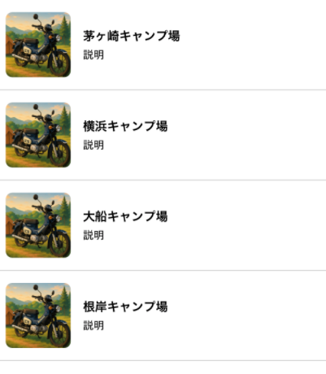
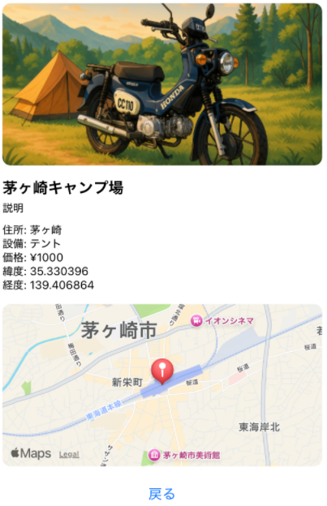

# Campsite React Native App

This is a demo mobile application built with **React Native + Expo**, which connects to a backend API for campsite information.

## 🔧 Features
- Login with hardcoded credentials (`admin` / `password`)
- Fetch and display a list of campsites
- View detailed campsite information including map and image
- Clean component structure for maintainability

## 📱 Screenshots

### Campsite List


### Campsite Detail


## 🚀 Getting Started

### 1. Clone the repository
```bash
git clone https://github.com/ttsukahara967/campsite_app_rn.git
cd campsite_app_rn
```

### 2. Install dependencies
```bash
npm install
```

### 3. Start the app
```bash
npx expo start
```

Scan the QR code with Expo Go on your mobile device.

> **Note**: Make sure your backend API is running and accessible from your mobile device (e.g., replace `localhost` with your local IP in `api/campsite.js`).

### 🔗 Backend API Required
This app requires the following backend API to be running:
- [campsite_go](https://github.com/ttsukahara967/campsite_go)

## 🗺️ Tech Stack
- React Native + Expo
- Axios for API requests
- react-native-maps for map display

## 📁 Project Structure
```
campsite_app_rn/
├── App.js
├── api/
│   └── campsite.js
├── components/
│   └── CampsiteCard.js
├── screens/
│   ├── CampsiteDetail.js
│   └── CampsiteList.js
└── img/
    └── campsite/sample.png
    └── screenshot/s1.png
    └── screenshot/s2.png
```

---

Feel free to customize and enhance the app further!
